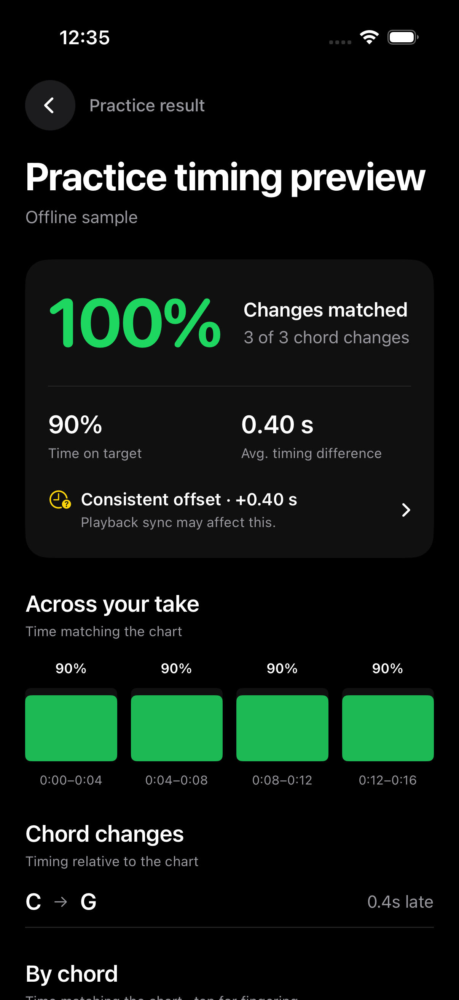
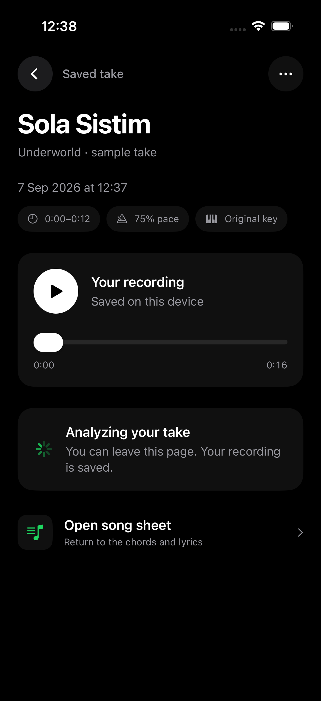
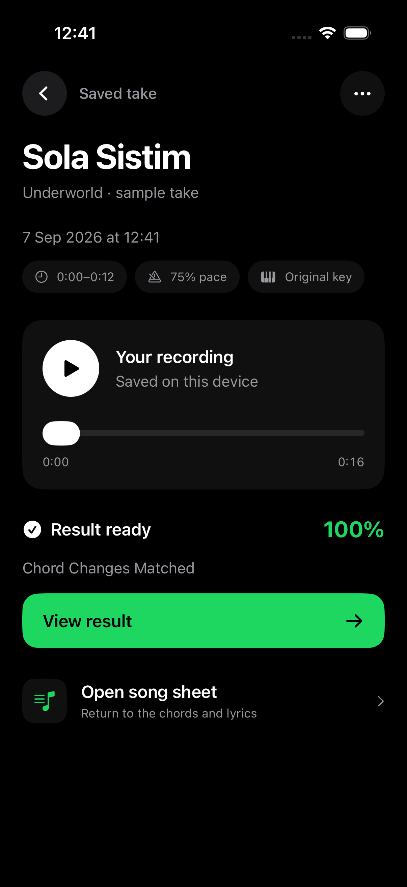

# Practice detail pages — 7 September 2026

Both pages keep the approved black/green palette and native typography. The result groups the headline score and two separate timing metrics into one compact surface. Consistent-offset detail and scoring explanations expand on demand. Section charts carry their percentages and time ranges; chord rows retain fingering actions and targeted drills.

The saved take uses the same heading and spacing, with compact range/pace/key metadata. A recording player reads the actual file duration, supports play/pause and seeking, and remains available during analysis. Uploading has a dedicated status surface instead of a disabled pill. Ready results have one primary action; analysis retry and offline messaging keep the saved recording accessible. Re-analysis and deletion live in the options menu, retaining the existing delete confirmation.

## Verification

- Debug simulator and signed Release iOS builds succeeded; signature verified.
- Practice feedback (27 checks), request/report contracts and saved-take persistence/recovery tests passed.
- Simulator interaction verified play, elapsed-time progression, pause preservation, and failed-analysis retry state.
- Loading, ready and accessibility text-size layouts were inspected. Sections switch to text rows at accessibility sizes; metrics stack and metadata wraps.
- The Release app was installed and launched on the paired iPhone. This change did not modify scoring or deploy the backend.

## Previews

All fixtures are explicitly marked samples. Saved-take previews generate quiet synthetic audio in isolated temporary storage and inject an offline scorer; no account takes are read or uploaded.

- `--practice-report-preview`, optionally `--practice-large-type`
- `--saved-take-preview`, optionally `--saved-take-scoring`, `--saved-take-ready`, `--saved-take-error`, or `--practice-large-type`

| Result | Analyzing | Ready |
| --- | --- | --- |
|  |  |  |
