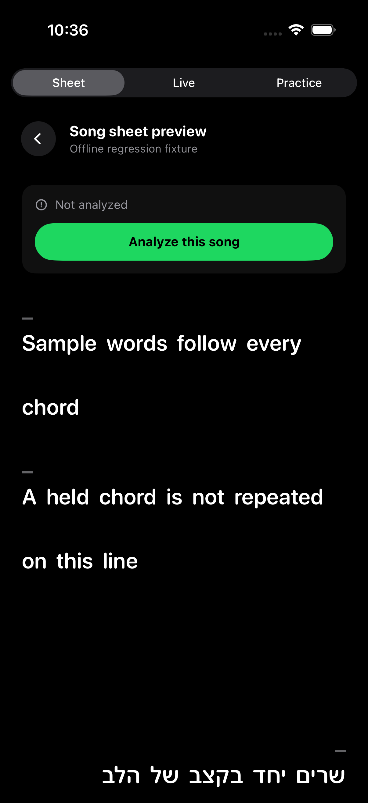
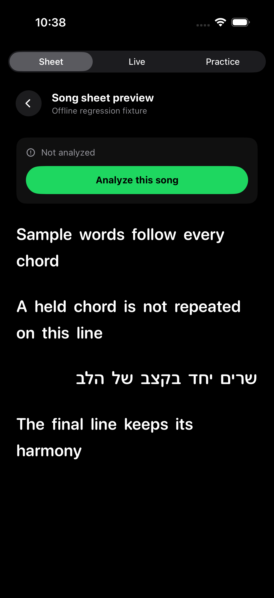
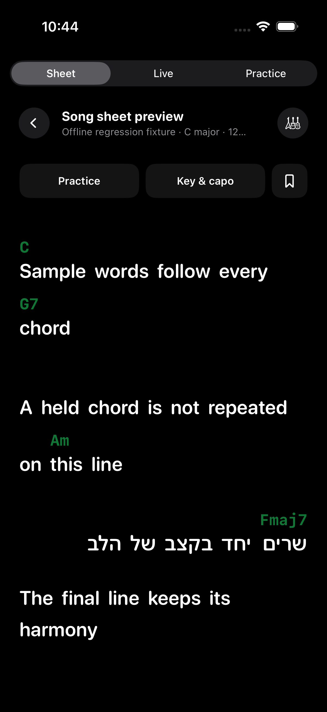

# Missing analysis and lyric spacing — 7 September 2026

The reported Spotify recording of **Shadows — Zero 7, Lou Stone** lasts 317.72 seconds. The saved video search returned shorter editions around 286–292 seconds, so the recording-duration check correctly refused them. The artist's [public Bandcamp recording](https://zero7.bandcamp.com/track/shadows) matches the full duration.

The worker now checks a reviewed ISRC source registry before its existing YouTube path. Extracted artist, title and duration must match; the decoded recording must independently pass the existing duration gate. A missing public stream falls back to the existing search. Source provenance identifies Bandcamp and the artist URL. This adds a reviewed source for this recording; it does not promise automatic discovery for every unavailable song.

The iOS sheet no longer renders empty chord placeholders above lyric-only text or blank timeline rows between lines. Timing gaps remain in the playback model and actual instrumental chord rows remain visible.

## Validation

- Song-sheet and playback tests: **1,095/1,095 passed**.
- Targeted backend source, downloader, jobs, submission and lyric-alignment tests: **127 passed**.
- Actual public-stream integration: decoded duration **317.720000 seconds**, temporary download removed.
- Debug Simulator and signed Release iOS builds succeeded; development signature verified.
- Simulator inspection covered missing analysis and ready charts, including wrapped English and right-to-left Hebrew.
- Fly deployment: `2026-09-07-artist-recording-recovery`, image digest `sha256:27fd4732106346febf81337ff6f60edeeb626aee1201a1055103f1c346024636`. API and worker smoke checks passed; existing library generation retained.
- Production retry of the existing Shadows job completed on its first attempt: **70 chord segments**, ISMIR2019 model, **317.72-second decoded audio**, `source: bandcamp`, and the reviewed artist URL in provenance. No shorter recording was substituted.
- The signed Release build is ready at `/tmp/chordlyze-device-build/Build/Products/Release-iphoneos/Chordlyze.app`. Installation of this spacing fix is pending: the paired physical iPhone became unavailable before the update. The server-side song recovery is already live for the installed app.

```sh
bash scripts/test_song_sheet.sh
cd backend
PYTHONPATH=. .venv/bin/python -m pytest tests/test_artist_recordings.py tests/test_fulltrack.py tests/test_audio_apify.py tests/test_song_jobs.py tests/test_submit.py tests/test_lyrics_align.py -q
```

The screenshots use authored offline fixture text, not user lyrics:

| Before | After | Ready chords |
| --- | --- | --- |
|  |  |  |
